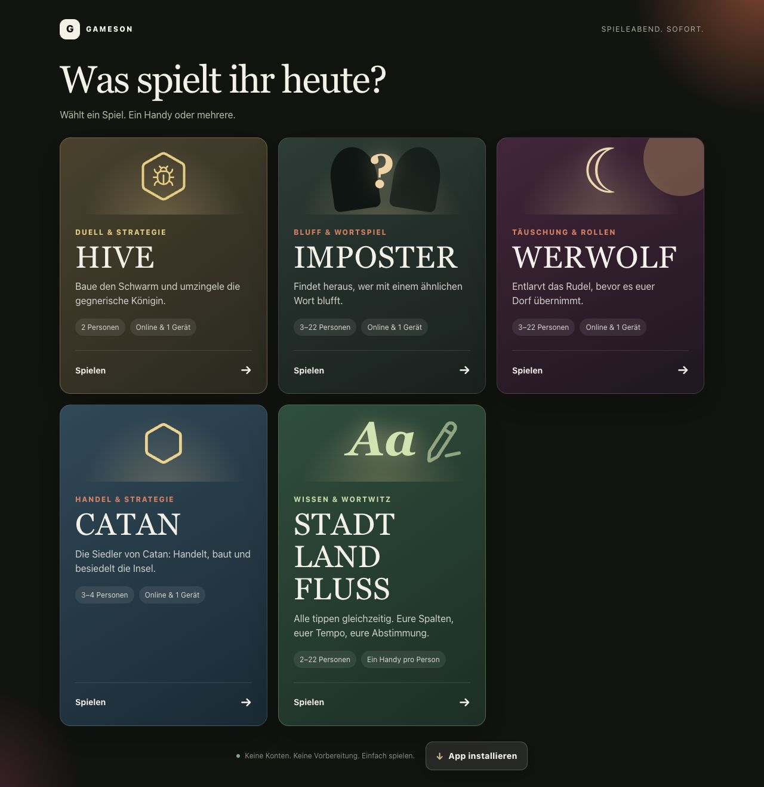
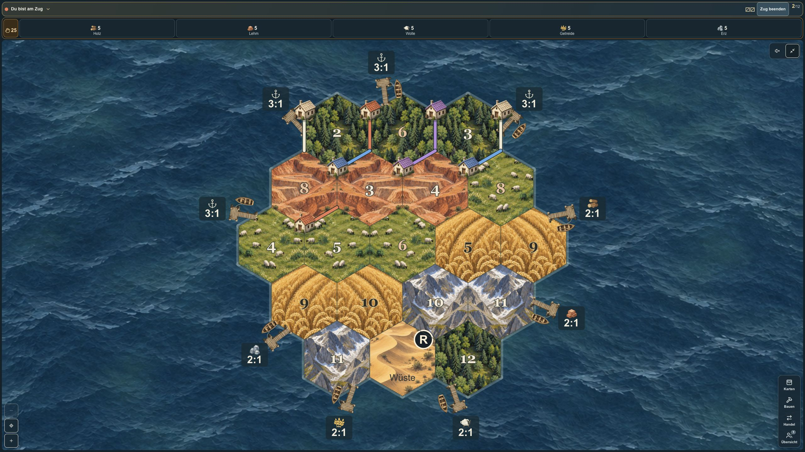

# Gameson

**Spieleabend. Sofort.** Five German games for your next games night, played on
separate phones or one shared device. No accounts are required. Gameson is an
installable web app with online lobbies, private player views and local play.

[Games](#games) · [Run locally](#run-locally) · [Development](#development) · [Hosting](#ubuntu-hosting-with-https) · [Artwork](assets/catan/README.md)



## Games

| Game | Players | Modes | Route |
| --- | --- | --- | --- |
| **HIVE** | 2 | Online or one shared device | `/hive` |
| **Imposter** | 3–22 | Online or one shared device | `/imposter` |
| **Werwolf** | 3–22 | Online or one shared device | `/werwolf` |
| **Die Siedler von Catan** | 3–4 | Online or one shared device | `/catan` |
| **Stadt Land Fluss** | 2–22 | One device per player, online | `/stadt-land-fluss` |

Online players join through invitation links, QR codes, lobby codes or group
names. Discoverable waiting lobbies appear to other devices on the same network;
hosts can turn discovery off. The home screen offers installation as a PWA.
Local games work offline after their pages and assets have been loaded online;
Catan and HIVE also save local progress after every move. Keep local Imposter
and Werwolf games open: reloading resets the current match. Online games require
a connection to the server.

### Catan in play



The island uses hand-painted terrain and building atlases. One sharp sea image
is continuously distorted on the GPU, with camera parallax while panning and
zooming. Reduced motion keeps a still background. The screenshot shows a sample
position using the real game components; the artwork and original generation
prompts are documented in [Catan artwork](assets/catan/README.md).

### HIVE

The 22-piece base game includes queens, beetles, grasshoppers, spiders and ants.
The rules engine enforces the fourth-turn queen deadline, one connected hive,
sliding gates, stack control, exact spider paths and straight grasshopper jumps.
Legal targets and a move preview appear before confirmation. Tapping a beetle
stack reveals its layers; selecting a blocked piece explains the relevant rule.

Pan, zoom or fit the board; resign, offer a draw or start a rematch with swapped
colors. Local players can undo a turn by mutual agreement. The six-exercise
[tutorial](app/hive/page.tsx) at `/hive?tutorial=1` uses separate practice
positions and preserves the saved game. Rules reference: [Gen42 HIVE](https://www.gen42.com/product/hive/).

### Imposter

Players receive related but different secret words, give clues and vote for the
suspected imposters. Choose a themed word pool, family or adult content, or add
custom word pairs. The number of imposters is configurable. On a shared device,
private cards stay hidden between players; online, each person receives their
own assignment.

### Werwolf

The app guides the group through private role reveals, night actions,
discussion, mayor elections and village votes. Wolf counts and additional roles
are configurable. Available roles include the seer, witch, hunter, cupid, thief,
healer, piper, wild child, elder, scapegoat and white werewolf.

Recorded announcements accompany the phases, with configurable audio modes and
pauses between announcements. Active recordings live in
[public/audio/werwolf](public/audio/werwolf/); unused source recordings are
explained in the [audio archive](assets/audio/werwolf-unused/README.md).

### Die Siedler von Catan

The base game includes randomized terrain with nonadjacent red numbers,
snake-order setup, resource production, limited bank and pieces, player and
harbor trading, the robber, discards, stealing, all 25 development cards and
both special awards. The victory target is selectable from 8 to 15, default 12;
choose 10 for the original target.

Online hands and deck order stay on the server. Atomic revisions validate
updates; authenticated WebSockets deliver confirmed moves to connected players.
The client reconciles every minute and falls back to 2.5-second HTTP polling
while reconnecting. Repeated revisions do not replay construction effects.
Local games hide private hands when passing the device.

The five areas—Island, Cards, Build, Trade and Overview—keep the current action
and resource hand available. The map supports drag, pinch zoom, centering and
fullscreen. Placement previews explain resources, probabilities, robber blocks
and ports. Construction and trades require explicit confirmation. Normal phase
changes preserve the chosen area and unfinished inputs; new required tasks or
incoming offers open the relevant area.

<details>
<summary>More Catan interface details</summary>

- Fullscreen keeps status and resources above the map and provides Cards, Build,
  Trade and Overview in a right-hand menu, with hover previews and pinned menus.
- A three-step setup guide explains placement and production probabilities. It
  can be skipped or reopened during setup.
- Development cards are grouped by type and availability; an older playable
  copy is preferred. Required discards replace the card list with quantity rows.
- Bank trades preview both resources, the harbor rate and affected stocks.
  Player offers use four steps; incoming offers expose accept, decline and
  counteroffer actions.
- Resource gains and payments appear in a private activity history. Trade
  changes are grouped, and unread receipts remain available on the next visit.
- Confirmed roads unroll over 700 ms; settlements and city upgrades rise over
  750 ms. Hidden views, restored games and reduced motion show finished pieces.
  Local setup roads allow an 800 ms transition before the next handoff.
- The sea pauses when the island or document is hidden. Its wave cycle lasts
  4.5 seconds; movement strength and camera parallax are separate settings.
- Optional synthesized sheep and wood-chopping sounds play for resource gains
  or field inspection. They start disabled and work offline.

</details>

### Stadt Land Fluss

Players write simultaneously in 2–12 custom columns, across 1–20 rounds with
an optional 15–1800 second timer. Defaults are Stadt, Land, Fluss, Tier and Beruf,
five rounds and 120 seconds. The host can change columns between rounds and
change or disable the timer during a round.

Answers autosave with per-player sequences; only the player's own answers are
returned during writing. The server enforces deadlines, and reloading restores
saved answers plus newer local drafts. Answers must reach the server before the
deadline; outstanding saves are shown in the UI.

During review, players can dispute answers and change their votes. A majority
of cast votes decides; ties accept an answer. Empty or wrong-initial answers
score 0, accepted duplicates 5, unique answers 10, and the only accepted answer
in a column 20. Each round uses a fresh letter, and the scoreboard retains all
rounds.

## Run locally

Requirements: **Node.js ≥22.13.0**, npm and Git. The app uses React, TypeScript
and vinext/Vite with a Cloudflare Worker runtime and the `DB` D1 binding. Local
Worker data is stored under `.wrangler/state/`, which is ignored by Git.

From a checkout, install dependencies, build the Worker configuration and
initialize Catan's table once before starting development:

```bash
npm ci
npm run build
npx wrangler d1 execute DB --local --persist-to .wrangler/state --config dist/server/wrangler.json --file drizzle/0007_catan.sql
npm run dev
```

Open [localhost:3000](http://localhost:3000). For a different development port:

```bash
npm run dev -- -p 3001
```

The Catan table migration is safe to repeat. Other game tables and supported
additive columns are created by the [runtime schema bootstrap](db/index.ts).
Catan's discovery columns are also added there; do not replay its later
`ALTER TABLE` migration after those columns already exist.

To preview the built Worker locally, stop the development server and run:

```bash
npx wrangler dev --config dist/server/wrangler.json --local --persist-to .wrangler/state --ip 127.0.0.1 --port 3000
```

## Development

| Command | Purpose |
| --- | --- |
| `npm run dev` | Development server with the local Worker/D1 runtime |
| `npm run build` | Production client and Worker build in `dist/` |
| `npm test` | Production build followed by automated tests |
| `npm run lint` | Source checks |
| `npm run db:generate` | Generate Drizzle migration SQL; does not apply it |

The tests cover game rules, APIs, sessions, UI rendering, map controls, realtime
updates and Ubuntu setup behavior.

### Catan UI preview

Build once, then start the local component preview:

```bash
npm run build
node tests/catan-ux-preview.mjs
```

Open [localhost:3002](http://localhost:3002). Prepared states cover setup,
trading, discards, card play, long histories and game over. For confirmed own
and remote construction animations, use:

```bash
CATAN_QA_FIXTURE=catan-construction.tsx node tests/catan-ux-preview.mjs
```

`CATAN_QA_PORT` overrides the preview port. Run one component preview at a time
and reload after component changes. The preview is a development tool and is
not an application route or part of the deployed UI.

### Repository map

| Path | Contents |
| --- | --- |
| [app/](app/) | Game pages, layouts, styles and API routes |
| [components/](components/) | Shared UI and game boards |
| [lib/](lib/) | Rules engines, sessions, audio and realtime helpers |
| [db/](db/) and [drizzle/](drizzle/) | D1 schema, runtime bootstrap and migrations |
| [worker/](worker/) | Worker entry point and Catan live Durable Object |
| [public/](public/) | PWA assets, active artwork and audio |
| [assets/](assets/) | Asset documentation and archived source material |
| [tests/](tests/) | Automated tests and browser preview fixtures |
| [scripts/setup-ubuntu.sh](scripts/setup-ubuntu.sh) | Ubuntu installer and updater |

The [Vite configuration](vite.config.ts) defines the local Worker bindings.
Catan push updates require the `CATAN_LIVE` Durable Object binding, exported
`CatanLobbyLive` class and `catan-live-v1` SQLite namespace migration. Keep those
entries in the generated Worker configuration. The Sites build also includes
hosting metadata and Drizzle migrations in `dist/.openai/`.

## Ubuntu hosting with HTTPS

The included setup supports Ubuntu 22.04 and 24.04. Install Git first, point the
domain's `A`/`AAAA` records to the server and allow inbound TCP ports 80 and 443.
The repository path must not contain spaces. The script installs the required
Node.js runtime, Nginx, systemd and Certbot; the persistent local Worker/D1
runtime listens on `127.0.0.1:3000` behind Nginx.

```bash
sudo install -d -o "$USER" -g "$(id -gn)" /opt/gameson
git clone https://github.com/MrRedsnow/gameson.git /opt/gameson
cd /opt/gameson
sudo ./scripts/setup-ubuntu.sh games.example.com admin@example.com
```

Rerun the same command to update. The installer fetches the current branch from
`origin`, allows only fast-forward updates and refuses changes to tracked files.
It installs dependencies and rebuilds when required. The service restarts when
the build or service configuration changes; a required build briefly stops the
running service. Valid Let's Encrypt certificates are reused and renewed within
the configured renewal window.

Data is kept outside the checkout in `/var/lib/gameson`, including D1 and
Durable Object state. Rebuilds preserve that directory.

```bash
systemctl status gameson
journalctl -u gameson -f
sudo systemctl restart gameson
sudo certbot renew --dry-run
```

When updating an installation with an older setup script, run
`git pull --ff-only` once before invoking it. Subsequent runs update the checkout
themselves. To deploy the current checkout without fetching, or force a rebuild:

```bash
sudo env GAMESON_UPDATE_REPO=0 ./scripts/setup-ubuntu.sh games.example.com admin@example.com
sudo env GAMESON_FORCE_REBUILD=1 ./scripts/setup-ubuntu.sh games.example.com admin@example.com
```

See the script's `--help` output for port, data-directory, branch and certificate
renewal options.

### Database backup

Stop the service before copying the entire data directory so SQLite/WAL files
and Durable Object state form a consistent backup:

```bash
sudo systemctl stop gameson
sudo tar -C /var/lib -czf "/root/gameson-backup-$(date +%F).tar.gz" gameson
sudo systemctl start gameson
```
